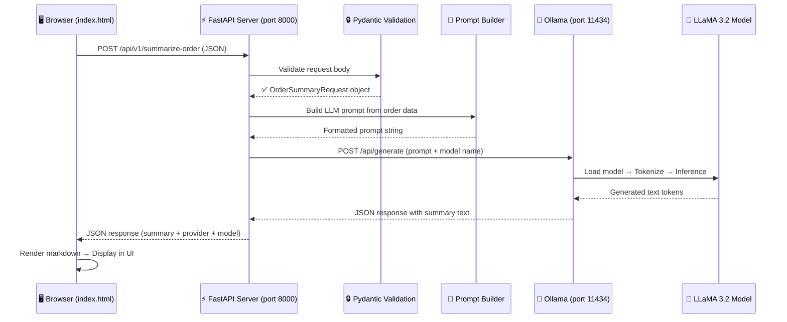
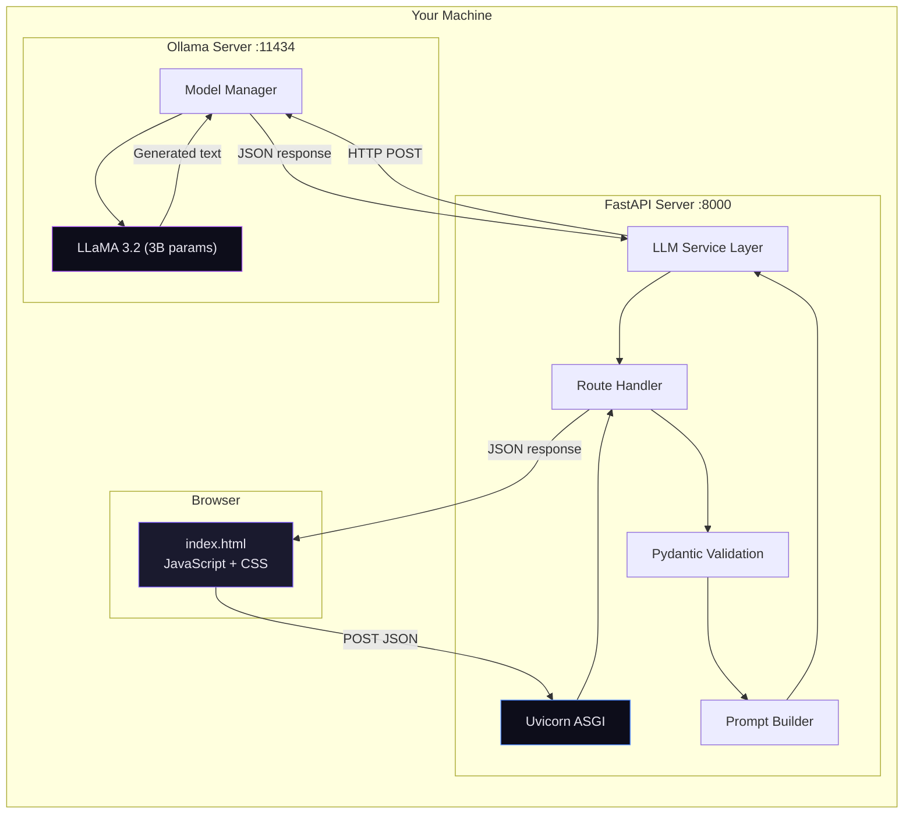

# 🔍 Technical Deep Dive — What Happens When You Click "Generate AI Summary"

## End-to-End Flow Diagram



---

## Stage-by-Stage Breakdown

---

### Stage 1️⃣ — Browser Collects Form Data
**File**: [index.html](file:///c:/Users/Admin/Documents/GEN AI POC/static/index.html) (JavaScript at the bottom)

When you click **"✨ Generate AI Summary"**, the JavaScript `submit` event handler fires:

```
User clicks button
    ↓
JavaScript reads all form fields (order ID, customer, line items, etc.)
    ↓
Builds a JSON object (payload)
    ↓
Sends HTTP POST request via fetch() API
```

**What the browser sends** (HTTP request):
```
POST http://localhost:8000/api/v1/summarize-order
Content-Type: application/json

{
  "order_id": "SBL-ORD-2026-0847",
  "customer_name": "Acme Corporation",
  "order_date": "2026-06-20",
  "status": "In Progress",
  "priority": "High",
  "line_items": [
    {"product_name": "Enterprise CRM License", "quantity": 10, "unit_price": 1200, "total_price": 12000},
    {"product_name": "Premium Support Package", "quantity": 1, "unit_price": 5000, "total_price": 5000}
  ],
  "total_amount": 17000.00,
  "currency": "USD",
  "notes": "Key account...",
  "user_question": "What risks do you see?"    ← optional
}
```

> [!NOTE]
> The browser also shows a loading animation at this point. The `fetch()` call is asynchronous — the UI remains responsive while waiting.

---

### Stage 2️⃣ — FastAPI Receives the Request
**File**: [main.py](file:///c:/Users/Admin/Documents/GEN AI POC/app/main.py)

The **Uvicorn ASGI server** (running on port 8000) receives the HTTP request and routes it to FastAPI.

```
HTTP POST /api/v1/summarize-order
    ↓
Uvicorn (ASGI server) receives raw HTTP bytes
    ↓
FastAPI matches the URL to this route handler:
```

```python
@app.post("/api/v1/summarize-order")
async def summarize_order_endpoint(order: OrderSummaryRequest):
    ...
```

**Key concept**: The `order: OrderSummaryRequest` parameter tells FastAPI:
- Parse the JSON body
- Validate it against the Pydantic model
- Convert it into a Python object

---

### Stage 3️⃣ — Pydantic Validates the Data
**File**: [models.py](file:///c:/Users/Admin/Documents/GEN AI POC/app/models.py)

Before any code runs, **Pydantic** automatically validates every field:

```
Raw JSON bytes
    ↓
Pydantic parses and validates:
    ✅ order_id → is it a string? → Yes
    ✅ quantity → is it >= 1? → Yes
    ✅ total_amount → is it >= 0? → Yes
    ✅ line_items → at least 1 item? → Yes
    ✅ user_question → optional, can be null → OK
    ↓
Creates a typed Python object: OrderSummaryRequest
```

**If validation fails** (e.g., missing `order_id`), FastAPI immediately returns a `422 Unprocessable Entity` error — the LLM is never called.

---

### Stage 4️⃣ — Prompt Builder Creates the LLM Prompt
**File**: [llm_service.py](file:///c:/Users/Admin/Documents/GEN AI POC/app/llm_service.py) → `_build_prompt()`

The validated order object is transformed into a **natural language prompt**:

```
Python OrderSummaryRequest object
    ↓
_build_prompt() function
    ↓
Checks: Did the user provide a question?
    ├── YES → "Answer this question about the order: {question}"
    └── NO  → "Provide a general summary with overview, details, highlights"
    ↓
Formats all order data into a structured text prompt
```

**Example output prompt sent to the LLM**:
```
You are an AI assistant integrated with Oracle Siebel CRM.
A user has asked the following question about an order:

USER QUESTION: What risks do you see?

Analyze the order details below...

ORDER DETAILS:
───────────────────────────────
Order ID      : SBL-ORD-2026-0847
Customer      : Acme Corporation
Total Amount  : $17,000.00
Line Items:
  - Enterprise CRM License: Qty 10 × $1,200.00 = $12,000.00
  - Premium Support Package: Qty 1 × $5,000.00 = $5,000.00
───────────────────────────────
```

---

### Stage 5️⃣ — LLM Call (Ollama → LLaMA 3.2)
**File**: [llm_service.py](file:///c:/Users/Admin/Documents/GEN AI POC/app/llm_service.py) → `_call_ollama()`

This is where the **AI magic happens**:

```
FastAPI (Python)
    ↓
httpx.AsyncClient sends HTTP POST to Ollama
    ↓
POST http://localhost:11434/api/generate
Body: {"model": "llama3.2", "prompt": "...", "stream": false}
    ↓
Ollama Server (Go application, port 11434)
    ↓
Loads LLaMA 3.2 model into memory (1.9 GB on CPU)
    ↓
Tokenizer converts prompt text → numeric tokens
    e.g., "Order" → [5765], "CRM" → [356, 44]
    ↓
Neural Network Inference (the slow part on CPU):
    - 28 transformer layers process the tokens
    - Each layer: attention → feed-forward → normalize
    - Generates ONE new token at a time (~4.7 tokens/sec on your CPU)
    - Repeats until it hits a stop token or max length
    ↓
Detokenizer converts output tokens → text
    ↓
Returns JSON: {"response": "**Order Summary**\n\nThis is a high-priority..."}
```

> [!IMPORTANT]
> **Why it's slow**: Your machine has no GPU. The model (3.2 billion parameters) runs entirely on CPU. Each token requires multiplying through 28 neural network layers. With a GPU, this would be ~10-50x faster.

**The provider pattern**: The code uses a strategy pattern — the same `summarize_order()` function works regardless of provider:

```
settings.LLM_PROVIDER = "ollama"  →  calls _call_ollama()
settings.LLM_PROVIDER = "openai"  →  calls _call_openai()
settings.LLM_PROVIDER = "anthropic" → calls _call_anthropic()
```

You switch providers by changing ONE line in `.env` — zero code changes.

---

### Stage 6️⃣ — Response Flows Back to Browser

```
Ollama returns summary text
    ↓
FastAPI wraps it in OrderSummaryResponse:
    {
        "order_id": "SBL-ORD-2026-0847",
        "summary": "**Order Summary**\n\nThis is a high-priority...",
        "provider": "ollama",
        "model": "llama3.2"
    }
    ↓
Uvicorn serializes to JSON + sends HTTP 200 response
    ↓
Browser's fetch() receives the response
    ↓
JavaScript parses JSON
    ↓
renderMarkdown() converts **bold**, bullets, headers → HTML
    ↓
Injects HTML into the response panel
    ↓
Shows provider badge ("ollama • llama3.2") + response time
```

---

## Architecture Summary



---

## File Responsibility Map

| File | Role | When Involved |
|------|------|---------------|
| [index.html](file:///c:/Users/Admin/Documents/GEN AI POC/static/index.html) | UI + form + API call + rendering | Stage 1 & 6 |
| [main.py](file:///c:/Users/Admin/Documents/GEN AI POC/app/main.py) | HTTP routing + error handling | Stage 2 |
| [models.py](file:///c:/Users/Admin/Documents/GEN AI POC/app/models.py) | Data validation (Pydantic schemas) | Stage 3 |
| [llm_service.py](file:///c:/Users/Admin/Documents/GEN AI POC/app/llm_service.py) | Prompt building + LLM provider calls | Stage 4 & 5 |
| [config.py](file:///c:/Users/Admin/Documents/GEN AI POC/app/config.py) | Reads .env settings | Used by Stage 5 |
| [.env](file:///c:/Users/Admin/Documents/GEN AI POC/.env) | Provider config + API keys | Read at startup |
